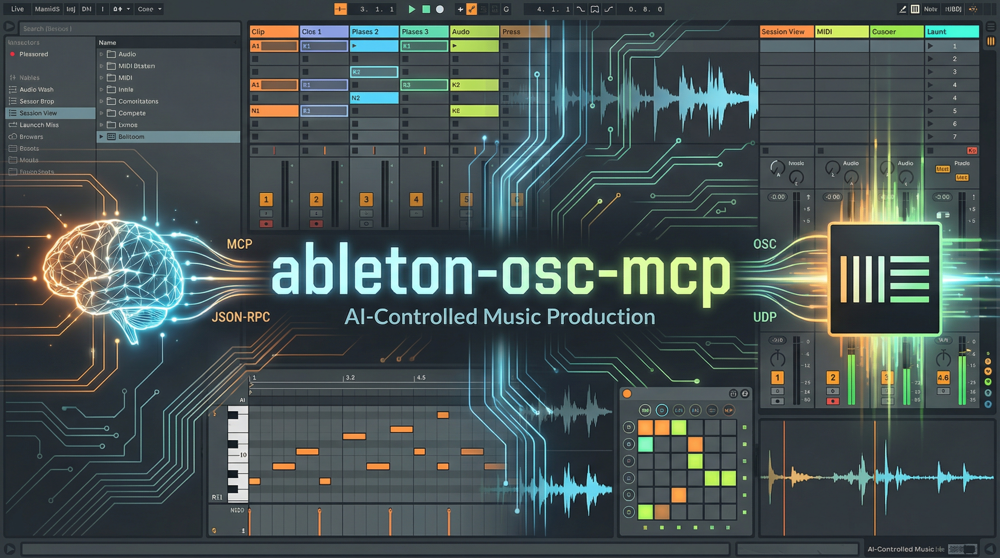
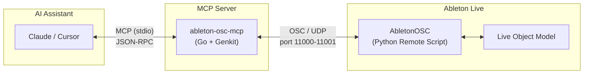
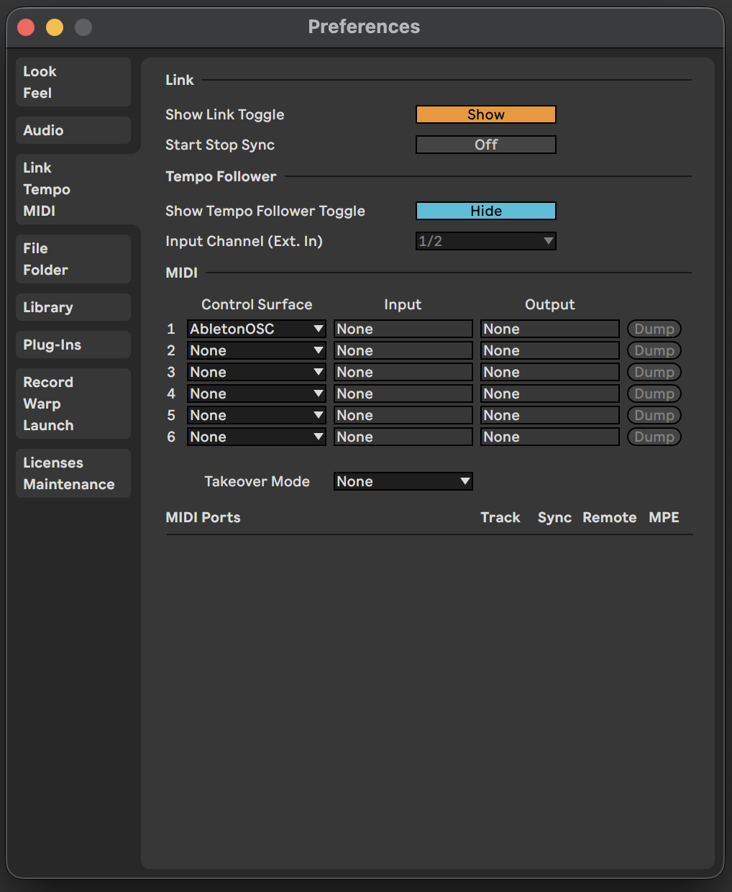

# ableton-osc-mcp



An MCP (Model Context Protocol) server for controlling **Ableton Live 11+** via [AbletonOSC](https://github.com/ideoforms/AbletonOSC).

This enables AI assistants (Claude, Cursor, etc.) to interact with Ableton Live for beat-making, music production, and creative workflows.

> **Note**: If you don't see a Homebrew formula or GitHub Release yet, use **Option C: Build from source** below.

## Features

- Control Ableton Live from AI assistants via MCP
- Create MIDI tracks and clips
- Add, read, and clear MIDI notes
- Get/set tempo
- Fire clip slots
- Send raw OSC messages for advanced control

## How it Works



### What is OSC?

[OSC (Open Sound Control)](https://opensoundcontrol.stanford.edu/) is a network protocol designed for real-time communication between music software and hardware. It uses UDP for low-latency messaging, making it ideal for music applications where speed matters more than guaranteed delivery.

### Communication Flow

1. **AI Assistant → ableton-osc-mcp**: MCP protocol over stdio (JSON-RPC)
2. **ableton-osc-mcp → AbletonOSC**: OSC messages over UDP (port 11000)
3. **AbletonOSC → ableton-osc-mcp**: OSC responses over UDP (port 11001)
4. **AbletonOSC → Ableton Live**: Direct access to Live Object Model (internal API)

The MCP server acts as a **translator** between MCP tool calls and OSC messages.

### Comparison with ableton-mcp

There's another Ableton MCP implementation: [ableton-mcp](https://github.com/ahujasid/ableton-mcp). Here's how they differ:

| | ableton-osc-mcp (this project) | ableton-mcp |
|---|---|---|
| **Remote Script** | [AbletonOSC](https://github.com/ideoforms/AbletonOSC) (existing OSS) | Custom implementation |
| **Protocol** | OSC / UDP (standard) | JSON over TCP sockets |
| **Language** | Go | Python |
| **Approach** | Uses standard OSC protocol | Custom protocol |

From an MCP client's perspective, both may **feel similar** (tools that create clips, set tempo, etc.). The big difference is the **underlying transport + remote script** (AbletonOSC/OSC vs custom script/socket protocol).

**Which should you choose?**

- **ableton-osc-mcp**: If you prefer standard protocols or want to reuse AbletonOSC for other purposes
- **ableton-mcp**: If you want tighter integration or need features not available via OSC

Both work well — choose based on your preference.

## Prerequisites

- **Ableton Live 11** or later
- **AbletonOSC** installed and enabled in Live

## Installation

> **Note**: Ableton Live is officially supported on **macOS** and **Windows** only.

### 1. Install AbletonOSC

> **Tip**: If the clone directory already exists, delete it first or skip the `git clone` step.

#### macOS

```bash
git clone https://github.com/ideoforms/AbletonOSC.git /tmp/AbletonOSC
mkdir -p ~/Music/Ableton/User\ Library/Remote\ Scripts
cp -r /tmp/AbletonOSC ~/Music/Ableton/User\ Library/Remote\ Scripts/AbletonOSC
```

#### Windows (PowerShell)

```powershell
git clone https://github.com/ideoforms/AbletonOSC.git $env:TEMP\AbletonOSC
Copy-Item -Recurse $env:TEMP\AbletonOSC "$env:USERPROFILE\Documents\Ableton\User Library\Remote Scripts\AbletonOSC"
```

#### Windows (Command Prompt)

```cmd
git clone https://github.com/ideoforms/AbletonOSC.git %TEMP%\AbletonOSC
xcopy /E /I %TEMP%\AbletonOSC "%USERPROFILE%\Documents\Ableton\User Library\Remote Scripts\AbletonOSC"
```

### 2. Enable AbletonOSC in Ableton Live

1. Open Ableton Live
2. Go to **Preferences** → **Link / Tempo / MIDI**
3. Under **Control Surface**, select **AbletonOSC**
4. Restart Ableton Live



### 3. Install ableton-osc-mcp

Choose the installation method that best fits your environment:

#### Option A: Homebrew (macOS/Linux) — Recommended

```bash
brew tap nozomi-koborinai/tap
brew install ableton-osc-mcp
```

The binary will be installed to `/opt/homebrew/bin/ableton-osc-mcp` (Apple Silicon) or `/usr/local/bin/ableton-osc-mcp` (Intel/Linux).

#### Option B: Download pre-built binary

Download from [GitHub Releases](https://github.com/nozomi-koborinai/ableton-osc-mcp/releases) for your platform:

| Binary | Platform | Architecture |
|--------|----------|--------------|
| `ableton-osc-mcp-darwin-arm64` | macOS | Apple Silicon |
| `ableton-osc-mcp-darwin-amd64` | macOS | Intel |
| `ableton-osc-mcp-linux-amd64` | Linux | x86_64 |
| `ableton-osc-mcp-windows-amd64.exe` | Windows | x86_64 |

> **macOS users**: After downloading, remove the quarantine attribute:
>
> ```bash
> chmod +x ableton-osc-mcp-darwin-*
> xattr -d com.apple.quarantine ableton-osc-mcp-darwin-*
> ```

#### Option C: Build from source

Requires Go 1.25+:

```bash
git clone https://github.com/nozomi-koborinai/ableton-osc-mcp.git
cd ableton-osc-mcp
go build -o ableton-osc-mcp .
```

### 4. Configure MCP Client

Find your binary path first:

```bash
# If installed via Homebrew
which ableton-osc-mcp
# Output: /opt/homebrew/bin/ableton-osc-mcp (Apple Silicon)
#         /usr/local/bin/ableton-osc-mcp (Intel/Linux)
```

#### Cursor

Add to `.cursor/mcp.json` in your project or global config:

```json
{
  "mcpServers": {
    "ableton-osc-mcp": {
      "command": "/opt/homebrew/bin/ableton-osc-mcp"
    }
  }
}
```

#### Claude Desktop

Add to `~/Library/Application Support/Claude/claude_desktop_config.json`:

```json
{
  "mcpServers": {
    "ableton-osc-mcp": {
      "command": "/opt/homebrew/bin/ableton-osc-mcp"
    }
  }
}
```

> **Note**: Replace `/opt/homebrew/bin/ableton-osc-mcp` with your actual binary path if different.

## Available Tools

| Tool | Description |
|------|-------------|
| `ableton_test` | Test connection to AbletonOSC |
| `ableton_show_message` | Display message in Live's status bar |
| `ableton_get_version` | Get Ableton Live version |
| `ableton_get_tempo` | Get current tempo (BPM) |
| `ableton_set_tempo` | Set tempo (BPM) |
| `ableton_get_track_names` | List track names |
| `ableton_create_midi_track` | Create a new MIDI track |
| `ableton_create_clip` | Create a new clip in a slot |
| `ableton_get_clip_notes` | Get MIDI notes from a clip |
| `ableton_add_midi_notes` | Add MIDI notes to a clip |
| `ableton_clear_clip_notes` | Clear all notes from a clip |
| `ableton_fire_clip_slot` | Fire (trigger) a clip slot |
| `ableton_osc_send` | Send raw OSC message |

## Example Usage

Once configured, you can ask your AI assistant:

- "Set the tempo to 140 BPM"
- "Create a MIDI track and add a 4-bar clip"
- "Add a kick drum pattern on beats 1, 2, 3, 4"
- "What's the current tempo?"

## Built With

- [Go](https://go.dev/) - Programming language
- [Genkit for Go](https://genkit.dev/docs/model-context-protocol/?lang=go) - AI framework with MCP support
- [AbletonOSC](https://github.com/ideoforms/AbletonOSC) - OSC interface for Ableton Live

## License

MIT License - see [LICENSE](LICENSE) for details.

## Related Projects

- [AbletonOSC](https://github.com/ideoforms/AbletonOSC) - OSC interface for Ableton Live (used by this project)
- [ableton-mcp](https://github.com/ahujasid/ableton-mcp) - Alternative MCP implementation (see [comparison](#comparison-with-ableton-mcp))

## Advanced Configuration

<details>
<summary>Environment Variables (usually not needed)</summary>

In most cases, the default settings work fine. Change these only if:

- **Ableton Live is running on a different machine** → change `ABLETON_OSC_HOST`
- **Port conflicts with other software** → change port settings
- **Heavy projects cause timeout errors** → increase `ABLETON_OSC_TIMEOUT_MS`

| Variable | Default | Description |
|----------|---------|-------------|
| `ABLETON_OSC_HOST` | `127.0.0.1` | AbletonOSC host |
| `ABLETON_OSC_PORT` | `11000` | AbletonOSC listen port |
| `ABLETON_OSC_CLIENT_PORT` | `11001` | Port for receiving replies |
| `ABLETON_OSC_TIMEOUT_MS` | `500` | Query timeout in milliseconds |

</details>

## Contributing

Contributions are welcome! Please feel free to submit a Pull Request.
