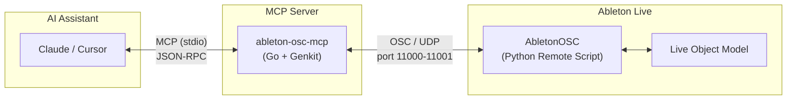

# ableton-osc-mcp


An MCP (Model Context Protocol) server for controlling **Ableton Live** via [AbletonOSC](https://github.com/ideoforms/AbletonOSC).

This enables AI assistants (Claude, Cursor, etc.) to interact with Ableton Live for beat-making, music production, and creative workflows.

**Primary development target: Ableton Live 11.0.12** (the Live Object Model reports `11.0`). Other Live 11/12 builds may work, but some tools depend on Live APIs that only exist (or behave differently) on newer versions — see [Supported Ableton Live versions](#supported-ableton-live-versions).

## Features

- Control Ableton Live from AI assistants via MCP
- Create MIDI tracks and clips
- Add, read, and clear MIDI notes
- Get/set tempo
- Inspect tempo, playback state, scenes, and indexed tracks in one snapshot
- List devices on a track
- Load Drum Racks / presets from Live's Browser (with the included AbletonOSC patch)
- Browse Live Browser folders by path and load items onto tracks
- Search the local synced Splice library and load samples onto audio tracks (Live 12.0.5+)
- Set up a drum track with kit + clip + pattern in one recipe
- Run drum / bass / scene A/B comparisons through one create→audition recipe, then save taste locally
- A/B the same clip dry vs processed by bypassing FX (`ableton_compare_fx_bypass`)
- Compare mix balance with snapshots you can restore
- Humanize MIDI clips with microtiming, velocity variation, and swing
- Match an audio clip to the project tempo with Warp (e.g. after loading a sample)
- Analyze a local `.wav`, or reference-analyze an `http(s)`/YouTube URL, for duration, levels, BPM/key alternatives, chords, section map, rhythm density, rms_per_beat, band balance, match axes, and texture (URL streams in memory and is never saved; no melody extraction)
- Autogain tracks toward a target meter level while audio is playing
- Diagnose AbletonOSC connection and browser/master patch readiness
- Fire clip slots and send raw OSC for advanced control

## Browser loading (AbletonOSC patch)

Stock [AbletonOSC](https://github.com/ideoforms/AbletonOSC) does not expose Live's Browser `load_item()` API.
This repo ships a small Remote Script patch under [`remote-script/`](remote-script/) that adds:

- `/live/browser/find`
- `/live/browser/list_folder`
- `/live/browser/load_at_path`
- `/live/track/load/browser_item`
- `/live/device/load/preset`
- `/live/clip_slot/create_audio_clip` (local audio file → session slot; Live 12.0.5+)
- `/live/device/get/parameters/value_string` (all parameter display strings in one reply)
- `/live/device/set/parameter/string` (set a parameter from a display string)
- `/live/device/delete` (delete a device; confirms with before/after device count)
- `/live/device/get|set/is_active` (device on/bypass for FX dry/wet A/B)
- `/live/device/simpler/get` · `/set` · `/get/slices` (Simpler playback/slicing state, control, and slice map)
- `/live/device/simpler/set/slices` (restore a saved manual slice map onto the same sample)
- `/live/song/get/return_tracks` (list return tracks for send indices)
- `/live/device/get|set/input_routing_type|channel` (+ available lists) for Compressor sidechain
- `/live/clip/envelope/get|set_steps|clear|clear_all` (+ `/live/clip/get/has_envelopes`) for Session clip automation

Install steps: see [remote-script/README.md](remote-script/README.md).
After applying the patch, **restart Ableton Live** (a full restart is required the first time; `/live/api/reload` alone is not enough).

## How it Works


```mermaid
flowchart LR
    subgraph AI["AI Assistant"]
        Claude["Claude / Cursor"]
    end

    subgraph MCP["MCP Server"]
        Server["ableton-osc-mcp<br/>(Go + Genkit)"]
    end

    subgraph Ableton["Ableton Live"]
        OSC["AbletonOSC<br/>(Python Remote Script)"]
        Live["Live Object Model"]
    end

    Claude <-->|"MCP (stdio)<br/>JSON-RPC"| Server
    Server <-->|"OSC / UDP<br/>port 11000-11001"| OSC
    OSC <--> Live
```

### What is OSC?

[OSC (Open Sound Control)](https://opensoundcontrol.stanford.edu/) is a network protocol designed for real-time communication between music software and hardware. It uses UDP for low-latency messaging, making it ideal for music applications where speed matters more than guaranteed delivery.

### Communication Flow

1. **AI Assistant → ableton-osc-mcp**: MCP protocol over stdio (JSON-RPC)
2. **ableton-osc-mcp → AbletonOSC**: OSC messages over UDP (port 11000)
3. **AbletonOSC → ableton-osc-mcp**: OSC responses over UDP (port 11001)
4. **AbletonOSC → Ableton Live**: Direct access to Live Object Model (internal API)

The MCP server acts as a **translator** between MCP tool calls and OSC messages.

### Comparison with ableton-mcp

There's another Ableton MCP implementation: [ableton-mcp](https://github.com/ahujasid/ableton-mcp). Here's how they differ:

| | ableton-osc-mcp (this project) | ableton-mcp |
|---|---|---|
| **Remote Script** | [AbletonOSC](https://github.com/ideoforms/AbletonOSC) (existing OSS) | Custom implementation |
| **Protocol** | OSC / UDP (standard) | JSON over TCP sockets |
| **Language** | Go | Python |
| **Approach** | Uses standard OSC protocol | Custom protocol |

From an MCP client's perspective, both may **feel similar** (tools that create clips, set tempo, etc.). The big difference is the **underlying transport + remote script** (AbletonOSC/OSC vs custom script/socket protocol).

**Which should you choose?**

- **ableton-osc-mcp**: If you prefer standard protocols or want to reuse AbletonOSC for other purposes
- **ableton-mcp**: If you want tighter integration or need features not available via OSC

Both work well — choose based on your preference.

## Prerequisites

- **Ableton Live 11+** (see version notes below)
- **AbletonOSC** installed and enabled in Live
- This repo's **Remote Script patch** applied (see [Browser loading](#browser-loading-abletonosc-patch))

## Supported Ableton Live versions

| Role | Version | Notes |
|------|---------|--------|
| **Primary target (developed & smoke-tested against)** | **Live 11.0.12** (API label `11.0`) | Default assumption for tool behavior and docs in this repo |
| Also intended to work | Live 11.x generally | Same LOM generation; minor UI/API differences may appear |
| Partially supported | Live 12.x | Extra APIs unlock some tools; others still need the patch |

Live's OSC/API only exposes a coarse version string (e.g. `11.0`), so this project documents the **full Suite build used in development** (11.0.12) separately from what `ableton_diagnose` reports.

**Version-gated or unavailable tools (examples):**

| Capability / tool area | Live 11.0.12 | Notes |
|------------------------|--------------|--------|
| Most transport, MIDI, browser load, Simpler slice, intents, routing, envelopes, FX bypass A/B, analysis | Available (with patch where noted) | Primary workflow |
| `ableton_load_splice_sample` / `create_audio_clip` (path → Session slot) | **Not available** | Needs Live **12.0.5+** (`ClipSlot.create_audio_clip`) |
| Drum Rack pad ← one-shot file load | **Not available** | Live 11 LOM cannot load a raw sample onto a single pad without replacing the rack |
| Clip envelope breakpoint *lists* | Limited | Live 11 samples via `value_at_time`; full breakpoint lists need Live 12+ |
| Destructive audio edit (crop / reverse / split / consolidate) | **Not exposed** | No stable LOM path; use non-destructive region extract / warp / pitch instead |

Before relying on a gated feature, call **`ableton_diagnose`** and check `capabilities[]` (`ok` / `next_step`). A tool that exists in the MCP schema may still fail or be a no-op on your Live build if the underlying API or patch handler is missing.

## Installation

> **Note**: Ableton Live is officially supported on **macOS** and **Windows** only.

### 1. Install AbletonOSC

> **Tip**: If the clone directory already exists, delete it first or skip the `git clone` step.

#### macOS

```bash
git clone https://github.com/ideoforms/AbletonOSC.git /tmp/AbletonOSC
mkdir -p ~/Music/Ableton/User\ Library/Remote\ Scripts
cp -r /tmp/AbletonOSC ~/Music/Ableton/User\ Library/Remote\ Scripts/AbletonOSC
```

#### Windows (PowerShell)

```powershell
git clone https://github.com/ideoforms/AbletonOSC.git $env:TEMP\AbletonOSC
Copy-Item -Recurse $env:TEMP\AbletonOSC "$env:USERPROFILE\Documents\Ableton\User Library\Remote Scripts\AbletonOSC"
```

#### Windows (Command Prompt)

```cmd
git clone https://github.com/ideoforms/AbletonOSC.git %TEMP%\AbletonOSC
xcopy /E /I %TEMP%\AbletonOSC "%USERPROFILE%\Documents\Ableton\User Library\Remote Scripts\AbletonOSC"
```

### 2. Enable AbletonOSC in Ableton Live

1. Open Ableton Live
2. Go to **Preferences** → **Link / Tempo / MIDI**
3. Under **Control Surface**, select **AbletonOSC**
4. Restart Ableton Live


### 3. Install ableton-osc-mcp

Choose the installation method that best fits your environment:

#### Option A: Homebrew (macOS/Linux) — Recommended

```bash
brew tap nozomi-koborinai/tap
brew install ableton-osc-mcp
```

The binary will be installed to `/opt/homebrew/bin/ableton-osc-mcp` (Apple Silicon) or `/usr/local/bin/ableton-osc-mcp` (Intel/Linux).

#### Option B: Download pre-built binary

Download from [GitHub Releases](https://github.com/nozomi-koborinai/ableton-osc-mcp/releases) for your platform:

| Binary | Platform | Architecture |
|--------|----------|--------------|
| `ableton-osc-mcp-darwin-arm64` | macOS | Apple Silicon |
| `ableton-osc-mcp-darwin-amd64` | macOS | Intel |
| `ableton-osc-mcp-linux-amd64` | Linux | x86_64 |
| `ableton-osc-mcp-windows-amd64.exe` | Windows | x86_64 |

> **macOS users**: After downloading, remove the quarantine attribute:
>
> ```bash
> chmod +x ableton-osc-mcp-darwin-*
> xattr -d com.apple.quarantine ableton-osc-mcp-darwin-*
> ```

#### Option C: Build from source

Requires Go 1.25+:

```bash
git clone https://github.com/nozomi-koborinai/ableton-osc-mcp.git
cd ableton-osc-mcp
go build -o ableton-osc-mcp .
```

### 4. Configure MCP Client

Find your binary path first:

```bash
# If installed via Homebrew
which ableton-osc-mcp
# Output: /opt/homebrew/bin/ableton-osc-mcp (Apple Silicon)
#         /usr/local/bin/ableton-osc-mcp (Intel/Linux)
```

#### Cursor

Add to `.cursor/mcp.json` in your project or global config:

```json
{
  "mcpServers": {
    "ableton-osc-mcp": {
      "command": "/opt/homebrew/bin/ableton-osc-mcp"
    }
  }
}
```

#### Claude Desktop

Add to `~/Library/Application Support/Claude/claude_desktop_config.json`:

```json
{
  "mcpServers": {
    "ableton-osc-mcp": {
      "command": "/opt/homebrew/bin/ableton-osc-mcp"
    }
  }
}
```

> **Note**: Replace `/opt/homebrew/bin/ableton-osc-mcp` with your actual binary path if different.

## A/B comparison workflow

For the usual drum, bass, or scene listen-and-choose loop, start here:

1. Optional: `ableton_get_taste_profile` — see what to try next
2. `ableton_compare_ab_variation` — create one-axis B, audition A→B, get a preference prompt
3. Ask the listener which they prefer, then `ableton_record_variation_preference`

Keep the lower-level tools for special cases:

| When you need… | Use |
|---|---|
| Create B without auditioning yet | `ableton_create_drum_variation` / `ableton_create_bass_variation` / `ableton_create_scene_energy_variation` |
| Audition clips/scenes that already exist | `ableton_audition_ab` |
| Mix balance A/B (volume deltas + restore) | `ableton_apply_mix_variation` → listen → record preference → `ableton_restore_mix_snapshot` |

Mix is intentionally outside `ableton_compare_ab_variation` because it uses snapshots, not clip/scene slots.

## Audio analysis

Two entry points estimate duration, peak/RMS level, onset density, BPM, and an
approximate musical key/scale to help you place or warp a sample and build a
part in a matching key. Both are **reference analysis only**: they extract
factual metadata and never transcribe lyrics or extract note-for-note MIDI of a
performance.

Key/scale is a chroma-based estimate (Krumhansl profiles) reported with a
confidence; treat it as a starting hint, since dense mixes can fool it.

They also return an approximate **chord progression**: the audio is split into
short windows, each matched to a major/minor triad, and consecutive matches are
merged into a timed sequence (`chord_progression`) plus a compact summary
(`chord_summary`, e.g. `C | G | Am | F`). Low-confidence spans are marked
`N.C.`. This covers only major/minor triads — extended chords, inversions, and
busy mixes will be approximated, so use it as a reference for building your own
part, not as a transcription.

They also return an approximate **section map** (`sections`): the track is
divided by a self-similarity/novelty analysis, and each span is labeled by
relative energy (`low` / `medium` / `high`) with its start time. Use it to spot
likely intros/breakdowns (low energy) versus drops/choruses (high energy). It is
a coarse structural map, not a semantic labeling of the song's form.

Finally, a few **texture indicators** describe the mix objectively:
`brightness_hz` (spectral centroid — higher is brighter), `crest_factor_db`
(peak-to-RMS — higher is more dynamic/transient, lower is more compressed), and
`stereo_width` (side/mid energy ratio — `0` is mono/centered, larger is wider).
URL sources are decoded in stereo so width can be measured, then downmixed for
the rest of the analysis.

For production decisions (not melody extraction), both tools also return:
- `bpm_alternatives` / `key_alternatives` — half/double tempo and second-best key when in range
- `rhythm_density` — onsets per bar at the estimated tempo
- `rms_per_beat` — per-beat energy envelope (capped) for chop / fill placement
- `band_balance` — relative low / mid / high energy shares
- `match_axes` — three observation axes (`drum_density`, `low_end_role`, `space_amount`) with short hints

- `ableton_analyze_local_audio` — inspects a **local `.wav` path you already have**. No network access.
- `ableton_analyze_audio_url` — reference-analyzes an `http(s)` URL (e.g. YouTube). It streams the track through `yt-dlp` + `ffmpeg` **in memory, analyzes it, and discards it** — nothing is written to disk (bounded to ~15 min for safety).

`ableton_analyze_audio_url` requires `yt-dlp` and `ffmpeg` on `PATH`; this server
never downloads on its own. Accessing some sites may violate their terms of
service, and you are responsible for your right to use any source you analyze.

Use results with files you have rights to use, then load into Live and call
`ableton_match_clip_tempo` if needed.

To turn a reference into a starting point, pass a `chord_summary` (or your own
progression like `C | G | Am | F`) to `ableton_build_chord_clip`, which writes a
block-chord MIDI clip into a MIDI track you can build on. It is a sketch, not a
finished arrangement.

## Available Tools

| Tool | Description |
|------|-------------|
| `ableton_test` | Test connection to AbletonOSC |
| `ableton_diagnose` | Diagnose AbletonOSC connection, browser/master patches, Live version, and feature capabilities (e.g. `create_audio_clip` needs Live 12.0.5+) |
| `ableton_preview_destructive` | Preview a destructive action (delete track/clip/device, clear notes/scene) as a diff summary without executing |
| `ableton_get_tempo` / `ableton_set_tempo` | Get/set tempo (BPM) |
| `ableton_play` / `ableton_stop` / `ableton_stop_all_clips` | Transport |
| `ableton_set_song_key` | Set root note and scale |
| `ableton_set_metronome` | Enable/disable metronome |
| `ableton_get_session_snapshot` | Get tempo, playback state, scene count, and indexed track names |
| `ableton_get_sounding_snapshot` | Conversation-resume anchor: mute/solo/playing slot, device chain, clip presence grid, scene names |
| `ableton_get_track_names` | List track names |
| `ableton_get_track_devices` | List devices on a track |
| `ableton_create_midi_track` | Create a MIDI track |
| `ableton_create_audio_track` | Create an audio track |
| `ableton_duplicate_track` | Duplicate a track (clips + devices); confirms via track count |
| `ableton_delete_track` | Delete a track (requires `confirm=true`; preview via `ableton_preview_destructive`) |
| `ableton_set_track_name` | Rename a track |
| `ableton_mute_track` / `ableton_solo_track` | Mute/solo |
| `ableton_arm_track` | Arm/disarm for recording |
| `ableton_get_track_input_routing` / `ableton_set_track_input_routing` | Input routing (e.g. Resampling) |
| `ableton_set_monitoring` | Monitoring state (0=In 1=Auto 2=Off) |
| `ableton_set_track_volume` | Set track volume |
| `ableton_create_clip` | Create a clip in a slot |
| `ableton_get_clip_notes` / `ableton_add_midi_notes` / `ableton_clear_clip_notes` | MIDI notes |
| `ableton_humanize_clip` | Add microtiming, velocity variation, and optional swing to clip notes |
| `ableton_match_clip_tempo` | Enable Warp on an audio clip so it follows the project tempo (`beats` or `complex`) |
| `ableton_analyze_local_audio` | Analyze a local `.wav` (BPM/key alternatives, density, rms_per_beat, band_balance, match_axes, sections, onset grid, texture). Rejects URLs; no melody/note extraction |
| `ableton_analyze_audio_url` | Reference-analyze an `http(s)`/YouTube URL (same production fields as local, minus the full onset list). Streams via yt-dlp+ffmpeg in memory; requires yt-dlp+ffmpeg |
| `ableton_compare_ab_variation` | Preferred A/B entry: create one drum/bass/scene variation, audition A→B, return a preference prompt |
| `ableton_compare_fx_bypass` | Same-clip FX A/B: bypass audio/MIDI effects (dry) then restore prior active state (wet); record with `instrument=fx variation=bypass` |
| `ableton_create_drum_variation` | Create-only drum A/B variation (groove / density / fill); use when you do not want audition yet |
| `ableton_create_bass_variation` | Create-only bass A/B variation (octave / staccato / groove) |
| `ableton_create_scene_energy_variation` | Create-only scene energy variation (lift / pullback); keeps B if fire fails |
| `ableton_audition_ab` | Audition existing A/B clips or scenes on Live song time |
| `ableton_record_variation_preference` | Save whether the source or variation matched your taste (drum, bass, scene, or mix) |
| `ableton_get_taste_profile` | Summarize saved A/B choices and suggest the next comparison |
| `ableton_fire_clip_slot` / `ableton_stop_clip` | Fire/stop a clip |
| `ableton_duplicate_clip_to` | Duplicate clip to another slot (same track, or cross-track via `target_track_index`) |
| `ableton_delete_clip` | Delete a clip from a slot (requires `confirm=true` when a clip is present) |
| `ableton_set_clip_name` | Rename a clip |
| `ableton_get_clip_properties` | Get a clip's edit state: pitch/transpose, detune, warp mode, gain, markers, loop (audio + MIDI) |
| `ableton_set_clip_pitch` | Transpose (semitones) and/or detune (cents) an audio clip |
| `ableton_set_clip_warp` | Set an audio clip's warping on/off and warp mode (Beats/Tones/Texture/Re-Pitch/Complex/REX/Complex Pro) |
| `ableton_set_clip_region` | Set a clip's start/end markers and loop points (beats) |
| `ableton_extract_clip_region` | Copy a region `[start_beats, end_beats]` of an audio clip into an empty slot as a new clip (non-destructive chop) |
| `ableton_get_clip_envelope` | Sample a Session clip automation envelope (volume/pan/send/device); Live 11 cannot list breakpoints (requires browser patch) |
| `ableton_set_clip_envelope_steps` | Write Session clip automation steps; creates envelope if needed (requires browser patch) |
| `ableton_clear_clip_envelope` | Clear one or all Session clip envelopes (`confirm=true`; requires browser patch) |
| `ableton_chop_draft` | Generate a MIDI draft that rearranges chop slices without reproducing the source order (`avoid_copy`); apply with `ableton_add_midi_notes` |
| `ableton_fire_scene` | Fire a scene |
| `ableton_get_scene_names` | List scene names with indices |
| `ableton_set_scene_name` | Rename a scene (e.g. Intro, Verse, Hook) |
| `ableton_create_named_scenes` | Append empty named scenes for section structure |
| `ableton_set_scene_clip_presence` | Subtractive arrangement: hide (delete) or restore clips on a scene row from a source scene |
| `ableton_get_device_parameters` | Device parameters, with human-readable `display_value` (units/enum names) and `is_quantized` (requires browser patch) |
| `ableton_set_device_parameter` | Set a device parameter by raw numeric value |
| `ableton_set_device_parameter_string` | Set a device parameter from a display string (e.g. `Ins`, `180 Hz`, `-3.5 dB`, `50 %`); requires browser patch |
| `ableton_delete_device` | Delete a device (requires `confirm=true`); confirms with device name and before/after count (requires browser patch) |
| `ableton_get_simpler` | Get Simpler state: playback/slicing mode, style, beat division, slice count, with readable names (requires browser patch) |
| `ableton_set_simpler_playback_mode` | Set Simpler playback mode: classic / one_shot / slicing (requires browser patch) |
| `ableton_set_simpler_slicing` | Set Simpler slicing style and/or beat division (requires browser patch) |
| `ableton_get_simpler_slices` | Get Simpler slice map: start in samples/seconds + default C1-based MIDI note (requires browser patch) |
| `ableton_save_slice_preset` | Save a Simpler's slice map to a reusable JSON preset (requires browser patch) |
| `ableton_load_slice_preset` | Restore a saved slice preset onto the same sample; guards by sample length (requires browser patch) |
| `ableton_list_slice_presets` | List saved slice presets |
| `ableton_apply_device_intent` | Apply human-readable parameter settings (e.g. HP 180 Hz) to a device in one call, resolving params by name; optionally save/load named intents (requires browser patch) |
| `ableton_list_intents` | List saved device intents |
| `ableton_duplicate_track_for_processing` | Duplicate a track into a dry/wet pair (original stays dry, copy becomes processed) |
| `ableton_get_return_tracks` | List return tracks (A/B/…) with send indices (requires browser patch) |
| `ableton_create_return_track` | Create a new return track |
| `ableton_get_track_sends` / `ableton_set_track_send` | Get/set send amounts to returns (~0..1; ~0.85 ≈ 0 dB) |
| `ableton_get_device_sidechain` / `ableton_set_device_sidechain` | Compressor sidechain input routing (Live 11+; requires browser patch) |
| `ableton_find_browser_item` | Search Live Browser (requires patch) |
| `ableton_list_browser_folder` | List Browser roots or folder children (requires patch) |
| `ableton_load_browser_item` | Load Drum Rack / instrument onto a track by name |
| `ableton_load_browser_path` | Load Browser item onto a track by exact path (requires patch) |
| `ableton_load_device_preset` | Hotswap a preset onto a device |
| `ableton_get_splice_library` | Locate the local Splice content folder (synced downloads only) |
| `ableton_search_splice_samples` | Search audio files under the local Splice library |
| `ableton_load_splice_sample` | Load a local Splice audio file into an empty audio-track clip slot (Live 12.0.5+, patch) |
| `ableton_get_track_meter` | Track output meter levels |
| `ableton_autogain_tracks` | Iteratively adjust track volumes toward a target meter level |
| `ableton_apply_mix_variation` | Mix A/B entry: apply small B volume changes and return the A snapshot |
| `ableton_capture_mix_snapshot` / `ableton_restore_mix_snapshot` | Capture or restore track volumes for mix A/B |
| `ableton_get_master_meter` / `ableton_get_master_volume` / `ableton_set_master_volume` | Master meter/volume (requires master patch) |
| `ableton_get_master_devices` / `ableton_get_master_device_parameters` / `ableton_set_master_device_parameter` | Master devices (requires master patch) |
| `ableton_load_on_master` | Load Browser item onto master (requires browser+master patch) |
| `ableton_get_session_record` / `ableton_set_session_record` | Session Record on/off |
| `ableton_bounce_session_pass` | Record a scene pass onto a Bounce track via Resampling (tens of seconds; does not export WAV) |
| `ableton_setup_drum_track` | Create MIDI drum track, load kit, fill clip with preset pattern (requires browser patch) |
| `ableton_build_chord_clip` | Write a MIDI chord-progression clip from a chord string (e.g. an analysis `chord_summary`); optional tempo + fire |
| `ableton_osc_send` | Send raw OSC message |

## Example Usage

Once configured, you can ask your AI assistant:

- "Set the tempo to 140 BPM"
- "Create a MIDI track, load Street Kit, and add a 4-bar clip"
- "Set up a Street Kit drum track with a four-on-floor pattern"
- "Compare a drum groove variation of clip 0 into empty slot 1, then ask which I prefer"
- "Check my taste profile and run the least-tried bass comparison next"
- "I prefer the variation; save that and suggest what to compare next"
- "Create a mix B with the bass 0.05 lower, let me listen, then restore A"
- "Humanize the drum clip with a bit of swing"
- "Warp that audio sample to the project tempo"
- "Analyze this local wav and tell me its BPM and how many bars it is at 128"
- "Autogain the drum and bass tracks while the beat is playing"
- "Search my local Splice library for a punchy kick and load one onto an audio track"
- "Find drum kits named Street in the browser"
- "List the Drums browser folder, then load Street Kit onto track 0"
- "Add a kick drum pattern on beats 1, 2, 3, 4"
- "What's the current tempo?"
- "Diagnose the AbletonOSC connection and patches"

## Built With

- [Go](https://go.dev/) - Programming language
- [Genkit for Go](https://genkit.dev/docs/model-context-protocol/?lang=go) - AI framework with MCP support
- [AbletonOSC](https://github.com/ideoforms/AbletonOSC) - OSC interface for Ableton Live

## License

MIT License - see [LICENSE](LICENSE) for details.

## Related Projects

- [AbletonOSC](https://github.com/ideoforms/AbletonOSC) - OSC interface for Ableton Live (used by this project)
- [ableton-mcp](https://github.com/ahujasid/ableton-mcp) - Alternative MCP implementation (see [comparison](#comparison-with-ableton-mcp))

## Advanced Configuration

<details>
<summary>Environment Variables (usually not needed)</summary>

In most cases, the default settings work fine. Change these only if:

- **Ableton Live is running on a different machine** → change `ABLETON_OSC_HOST`
- **Port conflicts with other software** → change port settings
- **Heavy projects cause timeout errors** → increase `ABLETON_OSC_TIMEOUT_MS`

| Variable | Default | Description |
|----------|---------|-------------|
| `ABLETON_OSC_HOST` | `127.0.0.1` | AbletonOSC host |
| `ABLETON_OSC_PORT` | `11000` | AbletonOSC listen port |
| `ABLETON_OSC_CLIENT_PORT` | `11001` | Port for receiving replies |
| `ABLETON_OSC_TIMEOUT_MS` | `500` | Query timeout in milliseconds |
| `ABLETON_OSC_TASTE_PROFILE_PATH` | OS user config directory / `ableton-osc-mcp/taste-profile.json` | Local path for saved A/B preferences |
| `ABLETON_OSC_SPLICE_PATH` | _(auto: `~/Splice` or `~/Documents/Splice`)_ | Local Splice content folder for sample search/load |

</details>

## Splice samples (local library)

This does **not** call the Splice cloud API or download new sounds. It uses samples already synced by the Splice desktop app.

1. Sync/download sounds in the Splice app
2. Optional: set `ABLETON_OSC_SPLICE_PATH` if auto-detect misses your folder
3. Re-copy `remote-script/abletonosc/browser.py` into AbletonOSC (adds `/live/clip_slot/create_audio_clip`) and restart Live
4. Use `ableton_search_splice_samples` → `ableton_load_splice_sample` on an **audio** track empty slot

Loading into a clip slot needs **Ableton Live 12.0.5+** (`ClipSlot.create_audio_clip`).

## Contributing

Contributions are welcome! Please feel free to submit a Pull Request.
